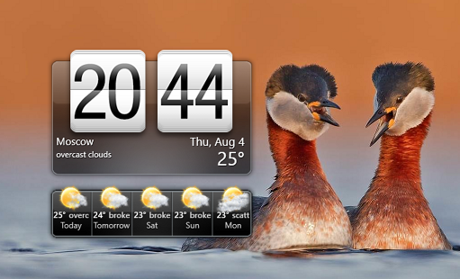

# HTC HOME 2.4.1-alpha
HTC HOME is some Stealth2012's HTC HOME remake :) 

This is the part of my own Origami project (Adaptive/Live shell, Aura, Metro and something else). 

Platform: Classic Desktop (not UWP)

## Screenshots

## Status
Work in sloooowly progress:
- Little code refacotring / commenting
- MSN weather provider deleted (Microsoft kills this service?)
- OpenWeatherMap weather provider added (weather forcast fixed, but current weather animation suddenly demaged...)

## Referencies
- [Artem Shuba](https://github.com/artemshuba) aka Stealth2012, original HTCHome developer 

## .
AS IS. No support. RnD only.

- [m][e] 2022